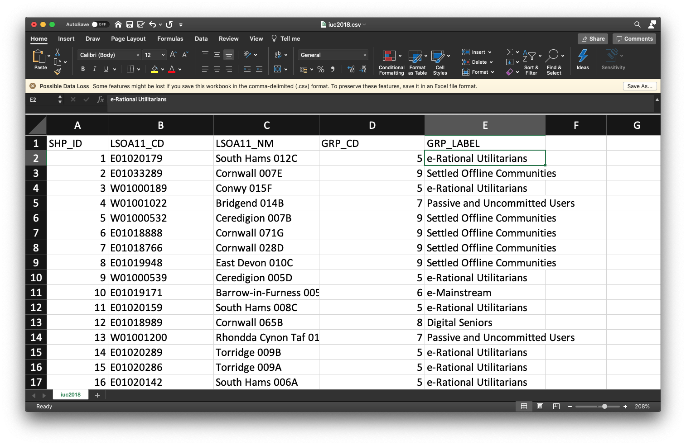

--- 
title: "GEOG0114: Principles of Spatial Analysis"
author: Justin van Dijk
date: "`r Sys.Date()`"
site: bookdown::bookdown_site
output: bookdown::gitbook
documentclass: book
link-citations: yes
github-repo: "jtvandijk/GEOG0114"
description: "GEOG0114: Principles of Spatial Analysis handbook."
url: 'https\://jtvandijk.github.io/GEOG0114/'
---

# About {-}

```{r echo=FALSE, out.width = "100%", fig.align='center', cache=TRUE,}
knitr::include_graphics('images/general/data_science_welcome_sm.jpg') 
```
<br />

Welcome to **Principles of Spatial Analysis**, one of the four core modules for the MSc in Geographic and Social Data Science here at [UCL Geography](https://www.geog.ucl.ac.uk/). This handbook contains practical material for four weeks of this year's module.

## Moodle {-}
[Moodle](https://moodle.ucl.ac.uk/) is the central point of your learning experience for GEOG0114 and contains everything you need to know about it. It's where you'll find links to all lecture content, reading materials, planned activities as well as key module and assessment information


<!--chapter:end:index.Rmd-->

# Spatial operations 

## This week {#this_week_w03}
Understanding spatial properties, relationships and how they are used within spatial operations are the building blocks to spatial data processing and analysis. This tutorial takes you through a simple approach to measuring greenspace access for schools in London, using geometric operations as the main methods for processing and analysing your data. You will construct a buffer data set around our greenspace and determine whether nearby schools intersect with this buffer. We will first visualise our data as points to see if we can identify areas of high versus low access - and then aggregate the data to the ward level for potential further use within analysis with statistical data, such as census information.

## Lecture recording {#lecture_w03}
```{r 03-lecture, warnings=FALSE, message=FALSE, echo=FALSE}
library(vembedr)
embed_msstream('6937ef38-bea9-402a-9027-fab842e62f4b') %>% use_align('left')
```
[[Lecture slides]](https://github.com/jtvandijk/GEOG0114/tree/master/data/slides/w03_psa.pdf) [[Watch on MS stream]](https://web.microsoftstream.com/video/6937ef38-bea9-402a-9027-fab842e62f4b)

## Reading list {#reading_w03}
- Gimond, M. 2021. Intro to GIS and spatial analysis. **Chapter 8**: Spatial operations and vector overlays. [[Link]](https://mgimond.github.io/Spatial/spatial-operations-and-vector-overlays.html)
- Longley, P. *et al.* 2015. Geographic Information Science & systems, **Chapter 13**: Spatial Analysis. [[Link]](https://rl.talis.com/3/ucl/items/fd38ec78-2bea-4165-aab3-0e9d9093db8e.html?lang=en-gb&login=1)
- Lovelace, R., Nowosad, J. and Muenchow, J. 2021. Geocomputation with R, **Chapter 4**: Spatial data operations. [[Link]](https://geocompr.robinlovelace.net/spatial-operations.html)
- Lovelace, R., Nowosad, J. and Muenchow, J. 2021. Geocomputation with R, **Chapter 5**: Geometry operations. [[Link]](https://geocompr.robinlovelace.net/geometric-operations.html)
- Bijnens, E. *et al.* 2020. Residential green space and child intelligence and behavior across urban, suburban, and rural areas in Belgium: A longitudinal birth cohort study of twins. *PLOS Medicine* 17(8), e1003213. [[Link]](https://doi.org/10.1371/journal.pmed.1003213)

## Case study {#case_study_w03}
Recent research ([Bijnens *et al.* 2020](https://doi.org/10.1371/journal.pmed.1003213)) has shown that children brought up in proximity to greenspace have a higher IQ and fewer behavioral problems, irrespective of socio-economic background. In our analysis today, we will look to understand whether there are geographical patterns to schools that have high versus low access of greenspace and where a lack of greenspace needs to be addressed in London. Below, we can see where schools are located in London and get a general understanding of their proximity to large greenspace just through a simple navigation of the map. In this practical we will try to quantify these visual patterns we may observe and find out which schools are within **400 metres** of greenspace that is larger than 50,000 square meters. We then calculate for each ward the percentage of schools that have access to a large greenspace.

```{r school_map, echo=FALSE, cache=FALSE}
# libraries
suppressMessages(library(sf))
suppressMessages(library(tmap))

# read school data
schools <- st_read('data/schools/school_data_london_2016.shp',stringsAsFactors=FALSE,quiet=TRUE)

# inspect
suppressMessages(tmap_mode('view'))
tm_shape(schools) +
  tm_dots() +
  tm_basemap(server='OpenStreetMap')
suppressMessages(tmap_mode('plot'))
```

## Getting started {#getting_started_w03}
To enable the efficient, repeatable and reproducible functionality of our work, we will use R-Studio's ability to create and host code as a script. Before we do anything therefore, we will need to create a new R script: **File** > **New File** > **R Script**

Let's go ahead and save our script now, so we know it's stored in our system - and in the future, we only need to remind ourselves to complete a quick save (e.g. `cmd` / `ctrl` + `s`).

Now we have our script created, we can create a new data folder within the same directory as where we saved our script then copy over our data into this folder. Call this folder **data**. Next, if you haven’t already, download this week’s practical data zipfile. Once downloaded, we want to move this zipfile from your *Downloads* and into this newly created data folder. You can do this either in your computer OS’s normal file management tool, e.g. finder in Mac OS, or you can do this using R-Studio within the *Files* pane. Lastly, we want to unzip the file to gain access to the data within our R environment.

#### File download {-}
| File                                                 | Type           | Link |
| :------                                              | :------        | :------ |
| London school and greenspace data                    |`shp`     | [Download](https://github.com/jtvandijk/GEOG0114/tree/master/data/zip/school_analysis.zip) |

## Working directory and libraries
The **first two tasks** you will do **everytime** you create a new script is to first, point your computer to your working directory (so it knows where all your data is) and second, (pre-emptively) load many of the libraries you think you'll be using in your analysis. At the moment, we know that we'll need to load some spatial data - therefore we need to load a library capable of handling our data sets. For this module, and preferably within your R programming moving forward, we will focus on using the `sf` or *Simple Features* library that allows us to load, manipulate, process and export spatial data. 

Your working directory is the folder on the computer where you wish to store the data files you are working with. If you are using RStudio, on the lower right of the screen is a window with a **Files tab**. If you click on this tab you can then navigate to the folder you wish to use as your working directory. You can then click on the **More** button and then **Set as Working Directory**. This means in our case: select the folder in which you just saved your R script! You should then see some code similar to the below appear in the command line. It is also possible to type the code in manually.

```{r 01-set-wd, warnings=FALSE, message=FALSE, eval=FALSE}
# set the working directory path to the folder you wish to use
setwd('/Users/UCL/GEOG0114/W01') 
# note the single / (\\ will also work)
```

<div class="note">
**Note**<br/>
Please ensure that **folder names** and **file names** do not contain spaces or special characters such as `*` `.` `"` `/` `\` `[` `]` `:` `;` `|` `=` `,` `<` `?` `>` `&` `$` `#` `!` `'` `{` `}` `(` `)`. Different operating systems and programming languages deal differently with spaces and special characters and as such including these in your folder names and file names can cause many problems and unexpected errors. As an alternative to using white space you can use an underscore `_` if you like.
</div>

In addition to the `sf` library, we want to add in the `tidyverse` library that will allow us to use the pipe function (`%>%`), among other things, within our work and enable more efficient programming. We are likely going to need some additional libraries to help further manipulate or visualise our data sets as we move forward with our processing - we'll add these in now, but explain them in a little more detail as we get to use them in our code. These libraries include: `units` and `tmap`.

<div class="note">
**Note**<br/>
Prior to the `sf` library, which was introduced to R-Studio in 2017, the `sp` library was the main spatial library used in R-Studio. As a result, you may see older code or scripts using the `sp` to handle spatial data. `sf` has replaced `sp` as the default spatial library as it works better with the `tidyverse` way of doing things. Ultimately, you can convert between the two library formats (and some other libraries we will use later on in the term still only work with `sp`) - but it is best practice to try to use the `sf` library in your code moving forward.
</div>

As a result, the top of our script should look something like:

```{r load-them-in, echo=TRUE, comment=FALSE, warning=FALSE, eval=FALSE}
# libraries
library(tidyverse)
library(sf)
library(tmap)
library(units)
```

```{r load-them-in-for-realz, echo=FALSE, comment=FALSE, warning=FALSE}
# libraries
suppressMessages(library(tidyverse))
suppressMessages(library(sf))
suppressMessages(library(tmap))
suppressMessages(library(units))
```

## Loading our data sets {#loading_data_w03}
For this analysis we have three different data sets available: schools in London, greenspace in London (split into two separate data sets), and wards (an administrative geography) in London. All three of our data sets are provided as shapefiles which will make working with the data relatively straight-forward (e.g. even for our point data, the schools, we do not need to convert them from  a `csv` as we often find with this type of data). **But** we'll need to do quite a few steps of processing to get our final data set.

Let's go ahead and load our three variables - we will use the `sf` library `st_read()` command to load our data sets into variables for use within our code:

```{r load-those-shapes, echo=TRUE, cache=FALSE}
# load london schools
london_schools <- st_read('data/schools/school_data_london_2016.shp')

# load london wards
london_wards <- st_read('data/administrative_boundaries/london_wards.shp')

# load london greenspace
TL_greenspace <- st_read('data/greenspace/TL_GreenspaceSite.shp')
TQ_greenspace <- st_read('data/greenspace/TQ_GreenspaceSite.shp')
```

To see what each variable looks like, you can type in `plot(name_of_variable)` into the R console. This is a quick command to understand both the spatial coverage and attributes of your data - as it will display the data by each of its attribute fields as a plot.

## Data Processing 
Now we have our data loaded as variables, we're ready to start processing! In spatial data processing, the question always is: where do I start first? And the easiest answer to that is: **make sure all of your data is in the same Projected (or Coordinate) Reference System as each other**. Checking - and changing projections - should always be the first step of any workflow as this will ensure you do not carry through any potential mistakes or errors that using the wrong system can cause.

### Reprojecting
When you loaded your data sets in the above step, you may have notice that in the console additional information about the data set is printed - this includes the metadata on the data set's Coordinate Referene System! As a result, it is quite easy to simply scroll the terminal to check the CRS for each data set - which as you'll see, all the data sets bar the school are using EPSG 27700, which is the code for British National Grid, whereas our schools data set shows 3857, the code for Web Mercator. That means we need to start with our *london_schools* variable - as we know that this is the only data set currently in the wrong projection instead of using British National Grid. 

To reproject our data set, we can use a function within the `sf` library, known as `st_transform()`. It is very simple to use - you only need to provide the function with the data set and the code for the new CRS you wish to use with the data. For now, we will simply store the result of this transformation as a new variable - but you could in the future, rewrite this code to use pipes to pipe this transformation when loading the data set.

```{r reproject, cache=FALSE}
# reproject london schools from Web Mercator to BNG 
london_schools_prj <- st_transform(london_schools, 27700)
```

We can now double-check our new variable is in the correct CRS by typing the following into the console and checking the result:

``` {r proj_check}
# check CRS 
st_crs(london_schools_prj)
```

As you can see from the output above, our data set has been reprojected into EPSG 27700 or British National Grid!

The next step to process our `london_schools_prj` data set is to reduce the schools to only our chosen London extent. As you may have seen from the map above, our schools cover an area larger than our usual London extent. We can even make a quick map of this to check this properly:

```{r where-those-schools-at, cache=FALSE}
# inspect
tm_shape(london_wards) + 
  tm_polygons() + 
tm_shape(london_schools_prj) + 
  tm_dots()
```

As we can see, we indeed  have schools outside of our London wards - as a result, we want to remove those schools outside of this boundary. We will do this by first dissolving our ward file to create a more simplified shapefile for use as a "cookie-cutter".

### Dissolving
To dissolve a polygon shapefile using R code, we will use the `summarise()` function that comes from the `dplyr` library (part of the `tidyverse`) and summarise our London wards data set by summing its total area (supplied in the *HECTARES* attribute field/column) across all records. This will reduce our data frame to a single row, which will only contain one attribute - our total area of London, which we can then map/use as our clip (cookie-cutter) feature! 

```{r dissolve-them-wards, cache=FALSE}
# dissolve
london_outline <- london_wards %>% summarise(area = sum(HECTARES))

# inspect
tm_shape(london_outline) +
  tm_polygons()
```

### Subsetting
Now we have our London outline, we can go ahead and clip our schools data set by our London outline. Whilst there is a clip function within the `sf` library, what we will do here is use a techinque known as spatial subsetting, which is more similar to *selecting by location*: we will subset our london schools data set by filtering out those that are not within the London Outline. This approach in R is much quicker than using the clip function - although deciding which approach to use is not only a question of speed but also how each function will affect the filtered data. When using a clip function, the function acts exactly like a cookie-cutter and will trim off any data that overlaps with the boundaries used. Conversely, when using a subsetting approach, if a data point or polygon overlaps on the boundary, it will still be included (depending on the *topological relationship* used) but in its entirety (i.e. no trimming!). 

As we're using point data, it is generally easier to use a **subset approach**. There are multiple ways and notations to conduct spatial subsetting within R: 

First, we can either use the `[]` notation just like you would use for selecting and slicing a normal (table-based) dataframe from R's base package. Second, `sf` has its own named functions for geometric operations, including: intersection, difference, symmetrical difference and snap. What actually happens is that when you use the `[]` notation on the background one of those `sf` named functions get called. More details on manipulating simple features can be found in this [vignette](https://r-spatial.github.io/sf/articles/sf4.html).

To keep things simple, we will use the base subsetting approach - which also works similarly when programming in Python, for instance.

```{r sub-set, cache=FALSE}
# subset London schools
london_schools_prj_ss <- london_schools_prj[london_outline,]
```

<div class="note">
**Note**<br/>
In a case like above, you can just overwrite the current *london_schools_prj* variable as you know it is the data set you want to use. Much of this code could be condensed into several lines using pipes to make our code shorter and more efficient - but then it would be harder to explain! As you progress with R and programming, you are welcome to bring pipes and restructuring into own your code - but even if you don't, as long as your code does what you need it to do, then that's our main aim with this course!
</div>

Once you have run the above code, you should notice that your *london_schools_prj_ss* variable now only contains 3,372 records, instead of the original 3,889. We can also plot our variable using the same code as above, to double-check that it worked:

```{r inspect-that-sub-set, cache=FALSE}
# inspect
tm_shape(london_wards) + 
  tm_polygons() + 
tm_shape(london_schools_prj_ss) + 
  tm_dots()
```

We should now see that our schools are all contained within our ward data set, so we know this data set is ready to be used for analysis. We will now explore which schools are within  400m of greenspace and which are not. But first, we need to get our greenspace data ready so we can create the 400m buffers needed for this analysis.

### Unioning
We've done a lot of processing so far to do with our schools and ward data, but now it's time for the greenspace data sets. If you look back at your code, you should remember that we have two data sets for our greenspace in London, which we now need to join together. This type of join is typically known as a **union** - and this is the type of tool you would want to look for across any GUI system. 

When it comes to programming, however, in either R or python, there is a much simpler way of joining data sets - and that's simply copying over the records or observations from one variable into another - and the `base` library has a ready-to-go function for us to use, known as `rbind()`. This function allows you to 'bind' rows from one or more data sets together. This also works for `sf` objects.

```{r a-green-union}
# join greenspace data sets together
greenspace = rbind(TQ_greenspace, TL_greenspace)
```

### Clipping
The next step is to clip our reduced greenspace data to our London outline. Within `sf`, the clip function is known as the `st_intersection()` function - not to be confused with `st_intersects()` from above! A clip will change the geometry of some of our greenspaces on the outskirts of London, i.e. cookie-cut them precisely to the London outline. If we used the subset approach approach as we did earlier with our point data, we would simply extract all greenspaces that intersect with the London outline - but not change their geometry.

What we can do however if reduce the processing required by our computer by using a mixture of these two methods - if we first subset our all_greenspace data set by our London outline and then run the clip, our processing will be much faster:

```{r clip_greenspace, cache=FALSE}
# subset and clip
london_greenspace <- greenspace[london_outline,] %>% st_intersection(london_outline)

# inspect
tm_shape(london_outline) + 
  tm_polygons() + 
tm_shape(london_greenspace) + 
  tm_polygons()
```

### Attribute selection
Now we have only London greenspaces in our data set, the next step, is to reduce the number of greenspaces to only those bigger than 50,000 square meters. To do this, we will use another type of subsetting you've probably come across, which is attribute subsetting - by using a simple query to subset only records that have an area larger than 50,000 square metres. To do this, we'll use the `filter()` function from the `dplyr` library we mentioned earlier as well as another function called `set_units()` which is from the `unit` library that you've loaded - but we haven't yet discussed. The `set_units()` function allows us to assign units to numerical values we are using within our query, i.e. here, for our query to run, our value must be in square metres to match the unit of the `area_m` column. 

To be able to query on our area, we must first calculate the area of each of our greenspaces. To do so in R, we can use the `st_area()` function within `sf`, which will calculate the area of each of our records/observations in our greenspace data set. To store the output of this function as a new column in our `london_greenspace` data set, we use a simple notation at the end of our *london_greenspace* variable: `$area_m`. The `$` in R means for this data frame, access the column that proceeds this sign. In our case, we do not as yet have a column called `area_m`, therefore R will automatically create this column and then store the outputs of the function in this column:

```{r size-up-that-greenspace, cache=FALSE}
# calculate area
london_greenspace$area_m <- st_area(london_greenspace)
```

Once we have our area column, we can now filter our data set based on that column and filter out all greenspace with an area that is smaller than 50,000 square meters.

```{r only-real-greenspace-pls, cache=FALSE}
# filter large greenspaces
large_london_greenspace <- london_greenspace %>% filter(area_m > set_units(50000.0, m^2))
```

We now can look at our final greenspace data set against our london outline to see its final coverage:

```{r check-that-final-greenspace, cache=FALSE}
# inspect
tm_shape(london_outline) + 
  tm_polygons() + 
tm_shape(large_london_greenspace) + 
  tm_polygons()
```

### Buffering
We now have our London greenspace data set - we are ready for the last step of processing with this data set - generating our buffers that we can use to find all schools within 400 meters of the large greenspace areas. Once again, the `sf` library has a function for generating buffers - we just need to know how to deploy it successfully on our London greenspace data set - and this involves understanding how to denote our distance correctly - as well as understanding if and how we can dissolve our buffer into a single record.

To do this, we would investigate the documentation of the function `st_buffer()` to find out what additional parameters it takes - and how. What we can find out is that we need to (of course!) provide a distance for our buffer - **but** whatever figure we supply, this will be interpreted within the **units** of the CRS we are using. In our case, we are using *British National Grid* and, luckily for us, the units of the CRS is metres - which makes are life significantly easier when calculating these buffers. For other CRS, many use a base unit of an Arc Degree, e.g. WGS84. In this case, you technically have two options: 1) reproject your data into a CRS that uses metres as its base unit OR 2) convert your distance into an Arc Degree measurement. **Always choose Option 1.**

Fortunately none of this is our concern - we know we can simply input the figure of 400 into our buffer and this will generate a buffer of 400m. 

```{r buffer-buffer, cache=FALSE}
# greenspace buffer
gs_buffer_400m <- st_buffer(large_london_greenspace, dist=400)
```

As our final bit of processing with our greenspace buffer, we want to dissolve the whole buffer into a single record. To do this, we'll replicate the code used for our London ward dissolve, creating a an area value for our buffer records in the process to be used within the summarisation - and then result in a new *gs_buffer_400m_single* variable:

```{r dissolve-that-buffer, cache=FALSE}
# dissolve greenspace buffer
gs_buffer_400m_single <- gs_buffer_400m %>% summarise(area = sum(st_area(gs_buffer_400m)))

# inspect
tm_shape(london_outline) + 
  tm_polygons() + 
tm_shape(gs_buffer_400m_single) + 
  tm_polygons()
```

## Greenspace in London
Great, we are now ready to bring our two data sets together reaady for anlaysis - and to do so, we'll use subsetting as well as the `st_intersects()` function, although with this one, we'll use it in two different ways!

Our first task is to identify those schools that have access to greenspace - and extract them to create a new variable for use within our final point-in-polygon count (i.e. how many schools within each ward has access to greenspace). As we know, we can subset our london_schools data set by our greenspace buffer quite easily using the subset approach:

```{r schools-with-that-green, cache=FALSE}
# schools within 400m of greenspace
london_schools_gs <- london_schools_prj_ss[gs_buffer_400m_single,]
```

Our *london_schools_gs* variable has been subsetted correctly if we end up with 1,770 records, instead of the 3,372 records we had previously. We can now use this data set and our previous *london_schools_prj_ss* data set to create counts at the ward level. But before we do that, we will create a binary attribute of greenspace access within our *london_schools_prj_ss* variable to visualise our school 'points'. To do this, we'll use the `st_intersects()` function mentioned above and add a new column, *gs_access* (i.e. greenspace access), which will tell us which schools have access to greenspace or not. 

The `st_intersects()` function is really useful as its output is a simple `TRUE` or `FALSE` statement - does this record intersect with the greenspace buffer? This result is what will be stored in our new column as a TRUE or FALSE response and what we can use to map our schools and their greenspace access:

```{r boolean-greenspace-schools, cache=FALSE}
# greenspace access
london_schools_prj_ss$gs_access <- st_intersects(london_schools_prj_ss, gs_buffer_400m_single, sparse=FALSE)
```

We could go ahead and recode this to create a 1 or 0, or YES or NO after processing, but for now we'll leave it as `TRUE` or `FALSE`. We can go head and now visualise our schools based on this column, to see if they have access (`TRUE`) or do not have access (`FALSE`) to greenspace. To do this, we'll use the `tmap` library again:

```{r show-that-space, cache=FALSE}
# inspect
tm_shape(london_schools_prj_ss) + 
  tm_dots(col='gs_access', palette='BuGn')
```

You'll be pleased to read that we are finally here - we are at the last stage of our processing and can finally create the ward-level percentage of schools that have greenspace access, versus those that do not! To do this, we'll be counting the number of points in each of our polygons, i.e. the number of schools in each ward.

To do so in R and with `sf`, it is one line of code - which at first look does not sound at all like it is completing a point-in-polygon calculation - but it does! To create a PIP count within `sf`, we use the `st_intersects()` function again - but instead of using the output of `TRUE` or `FALSE`, what we actually extract from our function is its `lengths` recording. The `lengths` part of this function records how many times a join feature (i.e. our schools) intersects with our main features (i.e. our wards). (Note here, we *do not* set the sparse function to `FALSE` but leave it as TRUE/its default by not entering the parameter). As a result, the length of this list is equal to the count of how many schools are within the polygon - i.e. a PIP calculation.

This is a really simple way of doing a PIP calculation - and makes it easy for us to store the output of the function and its `lengths` (and thus the count) directly as a column within our `london_wards` data set, as so:

```{r point-in-polygon-schools, cache=FALSE}
# total number of schools in each ward 
london_wards$total_schools <- lengths(st_intersects(london_wards, london_schools_prj_ss))

# total number of schools with greenspace access in each ward
london_wards$gs_schools <- lengths(st_intersects(london_wards, london_schools_gs))
```

As you can see from the code above, we've now calculated this for our total schools data set and the schools that have access to greenspace. The final step in our processing therefore is to create our rate. To do so, we'll use the same approach of generating a new column within our `london_wards` data set - and then use a mathematical formula to calculate our rates:

```{r rate-those-schools}
# percentage of schools with greenspace access
london_wards$gs_rate <- (london_wards$gs_schools/london_wards$total_schools)*100
```

And that's it! We now have our greenspace rate for our wards, which we can now again map:

```{r plot-the-final-result-yall, cache=FALSE}
# inspect
tm_shape(london_wards) + 
  tm_polygons(col='gs_rate', palette='Greens')
```

We now have our final data set ready for analysis. Right now, we haven't introduced you to any statistical or spatial analysis techniques to fully analyse our data set - but instead, we can focus on what are data shows visually!

The last step of any programming is to extract our variables into permanent data sets for use at a later time. You can at any point in this practical, extract a permanent data file for each of our variables. For now, we'll extract our new `london_wards` data set as we might want to use this in some additional analysis that we could look at next week or for our assessments at a later stage. The great thing about coding this up now, is that it will be easy to re-run all of this analysis and export any of the variables, again, at a later time!

```{r save-those-wards, eval=FALSE}
# write
st_write(obj=london_wards, dsn='data/london_ward_gs.shp', delete_dsn=TRUE)
```

You should now see the data set appear in your files!

## Attributions {#attributions_w03}
This week's content and practical uses content and inspiration from:

- Wilkin, Jo. 2020. Analysing school access to greenspace in London. https://github.com/jo-wilkin/R-GIS-Tutorials/blob/master/greenspace_access.Rmd

<!--chapter:end:01-spatial-operations.Rmd-->

# Spatial autocorrelation 

## This week {#this_week_w04}
This week, we focus on the first of two key properties of spatial data: spatial dependence. Spatial dependence is the idea that the observed value of a variable in one location is often dependent (to some degree) on the observed value of the same value in a nearby location. For spatial analysis, this dependence can be assessed and measured statistically by considering the level of spatial autocorrelation between values of a specific variable, observed in either different locations or between pairs of variables observed at the same location. Spatial autocorrelation occurs when these values are not independent of one another and instead cluster together across geographic space. 

A critical first step of spatial autocorrelation is to define the criteria under which a spatial unit (e.g. an areal or point unit) can be understood as a "neighbour" to another unit. As highlighted in previous weeks, spatial properties can often take on several meanings, and as a result, have an impact on the validity and accuracy of spatial analysis. This multiplicity also can be applied to the concept of spatial neighbours which can be defined through adjacency, contiguity or distance-based measures. As the specification of these criteria can impact the results, the definition followed therefore need to be grounded in particular theory that aims to represent the process and variable investigated. 

## Lecture recording {#lecture_w04}
```{r 04-lecture, warnings=FALSE, message=FALSE, echo=FALSE}
library(vembedr)
embed_msstream('01dc4984-23a2-43bf-8bf0-386ba2bc3ce3') %>% use_align('left')
```
[[Lecture slides]](https://github.com/jtvandijk/GEOG0114/tree/master/data/slides/w04_psa.pdf) [[Watch on MS stream]](https://web.microsoftstream.com/video/01dc4984-23a2-43bf-8bf0-386ba2bc3ce3)

## Reading list {#reading_w04}
- Gimond, M. 2021. Intro to GIS and spatial analysis. **Chapter 13**: Spatial autocorrelation. [[Link]](https://mgimond.github.io/Spatial/spatial-autocorrelation.html)
- Longley, P. *et al.* 2015. Geographic Information Science & systems, **Chapter 2**: The Nature of Geographic Data. [[Link]](https://rl.talis.com/3/ucl/items/ea2386fb-19dc-460a-acba-bda3737546c2.html?lang=en-gb&login=1)
- Longley, P. *et al.* 2015. Geographic Information Science & systems, **Chapter 13**: Spatial Analysis. [[Link]](https://rl.talis.com/3/ucl/items/fd38ec78-2bea-4165-aab3-0e9d9093db8e.html?lang=en-gb&login=1)
- Radil, S. 2016. Spatial analysis of crime. In: Huebner, B. and Bynum, T. *The Handbook of Measurement Issues in Criminology and Criminal Justice*, Chapter 24, pp.536-554. [[Link]](https://doi.org/10.1002/9781118868799.ch24)

## Case study {#case_study_w04}
This week looks at spatial dependence and autocorrelation in detail, focusing on the different methods of assessment. As part of this, we look at the multiple methods to defining spatial neighbours and their suitability of use across different spatial phenomena – and how this approach is used to generate spatial weights for use within these spatial autocorrelation methods as well as their potential to generate spatially-explicit variables. 

We put these learnings into practice through an analysis of spatial dependence of areal crime data, experimenting with the deployment of different neighbours and the impact of their analyses. For this practical we will look at the distribution of thefts from persons in the borough of Camden.

## Neighbours
If we want to come up with quantifiable descriptions of variables and how they vary over space, then we need to find ways of quantifying the distance from point to point. When you attach values to the polygons of wards in London, and visualise them, different patterns appear, and the different shapes and sizes of the polygons effect what these patterns look like. There can appear to be clusters, or the distribution can be random. If you want to explain and discuss variables, the underlying causes, and the possible solutions to issues, it becomes useful to quantify how clustered, or at the opposite end, how random these distributions are. This issue is known as spatial autocorrelation.
 
In raster data, variables are measured at regular spatial intervals (or interpolated to be represented as such). Each measurement is regularly spaced from its neighbours, like the pixels on the screen you are reading this from. With vector data, the distance of measurement to measurement, and the size and shape of the "pixel" of measurement becomes part of the captured information. Whilst this can allow for more nuanced representations of spatial phenomena, it also means that the quantity and type of distance between measurements needs to be acknowledged. 

If you want to calculate the relative spatial relation of distributions, knowledge of what counts as a "neighbour" becomes useful. Neighbours can be neighbours due to euclidean distance (distance in space), or they can be due to shared relationships, like a shared boundary, or they can simply be the nearest neighbour, if there aren't many other vectors around. Depending on the variable you are measuring the appropriateness of neighbourhood calculation techniques can change.

## Getting started {#getting_started_w04}
To begin let's load the libraries needed for this practical. Install the libraries where necessary.

``` {r 04-a-loading-in-libraries, warning=FALSE, eval=FALSE}
# libraries
library(sf)
library(nngeo)
library(data.table)
library(tmap)
library(tidyverse)
```

``` {r 04-a-loading-in-libraries-for-realz, echo=FALSE, warning=FALSE}
# libraries
suppressMessages(library(sf))
suppressMessages(library(nngeo))
suppressMessages(library(data.table))
suppressMessages(library(tmap))
suppressMessages(library(tidyverse))
```

Download the data necessary for the practical and put it in a folder we can find. We will use the same structure as the data directory from the previous week. If you are using the same directory for this weeks work then you can put these files in the same directories. If not make new ones with names that work. Alternatively you can make your own structure and use that. 

<div class="note">
**Note**<br/>
To follow along with the code as it is and not edit the file paths there should be a folder called **data/** in your project working directory, if not best to make one. Inside this create a folder called **crime**. Put the *2019_camden_theft_from_person.csv* file in that folder. Inside your **data/** directory there should already be a folder called **administrative_boundaries**. Save the files belonging to the *OAs_camden_2011.shp* in here.
</div>

#### File download {-}
| File                                                 | Type           | Link |
| :------                                              | :------        | :------ |
| Theft in Camden                                      |`shp`, `csv`    | [Download](https://github.com/jtvandijk/GEOG0114/tree/master/data/zip/camden_theft.zip) |

## Loading our data sets {#loading_data_w04}
Now we have the data in the correct folders, we can load and plot the shape data.

```{r load-those-shapes-for-camden, echo=TRUE}
# load camden boundaries
camden_oas <- st_read('data/administrative_boundaries/OAs_camden_2011.shp', crs=27700)

# inspect
tm_shape(camden_oas) +
  tm_polygons()
```

You can see how one of these output areas could have many more neighbours than others, they vary a great deal in size and shape. The dimensions of these objects change over space, as a result the measurements within them must change too.

Output areas are designed to convey and contain census information, so they are created in a way that maintains a similar number of residents in each one. The more sparsely populated an OA the larger it is. Output Areas are designed to cover the entirety of the land of England and Wales so they stretch over places where there are no people. In the north of Camden the largest Ouput Areas span over Hampstead Heath, a large park.

Let's explore how to find different kinds of neighbours using the example of one 'randomly' selected output area (**E00004174**) that happens to contain the UCL main campus.

``` {r 04-c-highlighting-one-oa}
# highlight E00004174
tm_shape(camden_oas) +
  tm_borders(col='black') +
tm_shape(camden_oas[camden_oas$OA11CD=='E00004174',]) +
  tm_fill(col='red')
```

## Euclidean neighbours
The first way we are going to call something a neighbour is by using Euclidean distance. As our OA shapefile is projected in BNG (British National Grid), the coordinates are planar, going up 1 is the same distance as going sideways 1. Even better the coordinates are in metric measurements so it's easy to make up heuristic distances. 

Let's call every output area with a centroid 500m or less away from the centroid of our chosen OA a neighbour:

- we select only the the centroid of our chosen output area and all other areas (with `st_centroid()`)
- we set the maximum number of neighbours we want to find to "50" (with parameter `k`)
- we set the maximum distance of calling an OA centroid a neigbour to "500" (with parameter `maxdist`)
- we return a sparse matrix that tells us whether each OA is a neighbour or not (with parameter `sparse`)

``` {r 04-d-euclidean-distance-neighbour, warning=FALSE, cache=FALSE}
# assign our chosen OA to a variable 
chosen_oa <- 'E00004174'

# identify neighbours
chosen_oa_neighbours <- st_nn(st_geometry(st_centroid(camden_oas[camden_oas$OA11CD==chosen_oa,])), 
                              st_geometry(st_centroid(camden_oas)),
                              sparse = TRUE,
                              k = 50,
                              maxdist = 500) 

# inspect
class(chosen_oa_neighbours)

# get the names (codes) of these neighbours
neighbour_names <- camden_oas[chosen_oa_neighbours[[1]],]
neighbour_names <- neighbour_names$OA11CD

# inspect
tm_shape(camden_oas) + 
  tm_borders() +
  # highlight only the neighbours
  tm_shape(camden_oas[camden_oas$OA11CD %in% neighbour_names,]) + 
  tm_fill(col = 'green') +
  # highlight only the chosen OA
  tm_shape(camden_oas[camden_oas$OA11CD==chosen_oa,]) + 
  tm_fill(col = 'red') +
  tm_shape(camden_oas) + 
  # overlay the borders
  tm_borders(col='black')
```

## Shared boundary neighbours
The next way of calculating neighbours takes into account the actual shape and location of the polygons in our shapefile. This has only recently been added to the world of `sf()`, previously we would have reverted to using the `sp()` package and others that depend on it such as `spdep()`.

We can create two functions that check whether any polygons share boundaries or overlap one another, and then also check by how much. These new functions are based on the `st_relate()` function. The different cases of these are known as queen, and rook. These describe the relations in a similar way to the possible chess board movements of these pieces. 

<div class="note">
**Note**<br/>
Do have a look at the short lectures by Luc Anselin on [Moran's I](https://www.youtube.com/watch?v=qWQ1Pa5cbtw), the [interpretation of Moran's I](https://www.youtube.com/watch?v=_J_bmWmOF3I), and [neighbours and spatial weights](https://www.youtube.com/watch?v=xMXFvRO4cEM) for some additional explanation on measuring spatial autocorrelation with Moran's I.
</div>

``` {r 04-e-shared-boundary-neighbour-function-creation, cache=FALSE}
# for rook case
st_rook = function(a, b = a) st_relate(a, b, pattern = 'F***1****')

# for queen case
st_queen <- function(a, b = a) st_relate(a, b, pattern = 'F***T****')
```

Now that we've created the functions lets try them out.

``` {r 04-f-shared-boundary-neighbour-example, cache=FALSE}
# identify neighbours
chosen_oa_neighbours <- st_rook(st_geometry(camden_oas[camden_oas$OA11CD==chosen_oa,]), 
                                st_geometry(camden_oas))

# get the names (codes) of these neighbours
neighbour_names <- camden_oas[chosen_oa_neighbours[[1]],]
neighbour_names <- neighbour_names$OA11CD

# inspect
tm_shape(camden_oas) + 
  tm_borders() +
  # highlight only the neighbours
  tm_shape(camden_oas[camden_oas$OA11CD %in% neighbour_names,]) + 
  tm_fill(col = 'green') +
  tm_shape(camden_oas[camden_oas$OA11CD==chosen_oa,]) + 
  # highlight only the chosen OA
  tm_fill(col = 'red') +
  tm_shape(camden_oas) + 
  # overlay the borders
  tm_borders(col='black')
```

<div class="note">
**Note**<br/>
Because the tolerance of the shared boundaries in the `st_rook()` pattern and the `st_queen()` pattern, in this example they both assign the same neighbours. This is true for many non-square polygons as the difference is often given as whether two shapes share one or more points. Therefore the difference can have more to do with the resolution and alignment of your polygons than the actual spatial properties they represent. They can and do find different neighbours in other situations. Follow the grid example in the `st_relate()` documentation if you want to see it working.
</div>

## Theft in Camden
Now that we have found the different ways of finding neighbours we can consider how they relate to one another. There are two ways of looking at spatial autocorrelation:

- **Global:** This is a way of creating a metric of how regularly or irregularly clustered the variables are over the entire area studied.
- **Local:** This is the difference between an area and its neighbours. You would expect neighbours to be similar, but you can find exceptional places and results by seeing if places are quantifiably more like or dislike their neighbours than the average other place. 

But before we start that let's get into the data we are going to use! We'll be using personal theft data from around Camden. Our neighbourhood analysis of spatial autocorrelation should allow us to quantify the pattern of distribution of reported theft from persons in Camden in 2019.

``` {r 04-g-loading-in-crime-data, cache=FALSE}
# load theft data
camden_theft <- fread('data/crime/2019_camden_theft_from_person.csv')

# convert csv to sf object
camden_theft <- st_as_sf(camden_theft, coords = c('X','Y'), crs = 27700)

# inspect
tm_shape(camden_oas) +
  tm_polygons() +
tm_shape(camden_theft) +
  tm_dots()
```

This is point data, but we are interested in the polygons and how this data relates to the administrative boundaries it is within. Let's count the number of thefts in each OA. This is a spatial operation that is often called "point in polygon". As we are just counting the number of occurrences in each polygon it is quite easy. In the future you may often want to aggregate over points for an area, or in reverse assign values from the polygon to the points.

``` {r 04-h-point-in-polygon, cache=FALSE}
# thefts in camden
camden_oas$n_thefts <- lengths(st_intersects(camden_oas, camden_theft))

# inspect
tm_shape(camden_oas) +
  tm_fill(col='n_thefts')
```

You can see our map isskewed by central London, meaning that the results in central London (the south of Camden) are so much larger than those in the north that it makes it harder to see the smaller differences between other areas. We'll take the square root of the number of thefts to remedy this.

``` {r 04-square-root, cache=FALSE}
# square root of thefts
camden_oas$sqrt_n_thefts <- sqrt(camden_oas$n_thefts)

# inspect
tm_shape(camden_oas) +
  tm_fill(col='sqrt_n_thefts')
```

There: a slightly more nuanced picture

## Global Moran's I
With a [Global Moran's I](https://en.wikipedia.org/wiki/Moran%27s_I) we can test how "random" the spatial distribution of these values is. Global Moran's I is a metric between -1 and 1. -1 is a completely even spatial distribution of values, 0 is a "random" distribution, and 1 is a "non-random" distribution of clearly defined clusters.

To calculate the Global Moran's I you need an adjacency matrix that contains the information of whether or not an OA is next to another. For an even more nuanced view you can include distance, or a distance weighting in the matrix rather than just the `TRUE` or `FALSE`, to take into account the strength of the neighbourhoodness. Because of the way Moran's I functions in R it is necessary to use the `sp` and `spdep` libraries. So load them in.

``` {r 04-j-load-sp-spdep, warning=FALSE, cache=FALSE}
# libraries
library(sp)
library(spdep)
```

As you will see these methods and functions have quite esoteric and complicated syntax. Some of the operations they will do will be similar to the examples shown earlier, but the way they assign and store variables makes it much quicker to run complex spatial operations.

``` {r 04-k-converting-to-sp, cache=FALSE}
# inspect
class(camden_oas)

# convert to sp
camden_oas_sp <- as_Spatial(camden_oas, IDs=camden_oas$OA11CD)

# inspect
class(camden_oas_sp)
```

Now we can make the esoteric and timesaving "nb" object in which we store for each OA which other OAs are considered to be neighbours.

``` {r 04-l-nb-time, cache=FALSE}
# create an nb object
camden_oas_nb <- poly2nb(camden_oas_sp, row.names=camden_oas_sp$OA11CD)

# inspect
class(camden_oas_nb)

# inspect
str(camden_oas_nb,list.len=10)
```

Next, we need to assign weights to each neighbouring polygon. In our case, each neighbouring polygon will be assigned equal weight with `style='W'`. After this, we can calculate a value for the Global Moran's I. 

``` {r 04-n-list-weights-object, cache=FALSE}
# create the list weights object
nb_weights_list <- nb2listw(camden_oas_nb, style='W')

# inspect
class(nb_weights_list)

# Moran's I
mi_value <- moran(camden_oas_sp$n_thefts,nb_weights_list,n=length(nb_weights_list$neighbours),S0=Szero(nb_weights_list))

# inspect
mi_value
```

The Global Moran's I seems to indicate that there is indeed some spatial autocorrelation in our data, however, this is just a quick way to check the score. To do so properly we need to compare our score a randomly distributed version of the variables. We can do this by using something called a [Monte Carlo simulation](https://en.wikipedia.org/wiki/Monte_Carlo_method).

``` {r 04-o-monte-carlo-moran, cache=FALSE}
# run a Monte Carlo simulation 599 times
mc_model <- moran.mc(camden_oas_sp$n_thefts, nb_weights_list, nsim=599)

# inspect
mc_model
```

This model shows that our distribution of thefts differs significantly from a random distribution. As such, we can conclude that there is significant spatial autocorrelation in our theft data set.

## Local Moran's I
With a measurement of local spatial autocorrelation we could find hotspots of theft that are surrounded by areas of much lower theft. According to the previous global statistic these are not randomly distributed pockets but would be outliers against the general trend of clusteredness! These could be areas that contain very specific locations, where interventions could be made that drastically reduce the rate of crime rather than other areas where there is a high level of ambient crime.

``` {r 04-p-local-spatial-autocorrelation, cache=FALSE}
# create an nb object
camden_oas_nb <- poly2nb(camden_oas_sp, row.names=camden_oas_sp$OA11CD)

# create the list weights object
nb_weights_list <- nb2listw(camden_oas_nb, style='W')

# Local Moran's I
local_moran_camden_oa_theft <- localmoran(camden_oas_sp$n_thefts, nb_weights_list)
```

To properly utilise these local statistics and make an intuitively useful map, we need to combine them with our crime count variable. Because of the way the new variable will be calculated, we first need to rescale our variable so that the mean is 0. 

``` {r 04-q-rescale, cache=FALSE}
# rescale
camden_oas_sp$scale_n_thefts <- scale(camden_oas_sp$n_thefts)
```

To compare this rescaled value against its neighbours, we subsequently need to create a new column that carries information about the neighbours. This is called a spatial lag function. The "lag" just refers to the fact you are comparing one observation against another, this can also be used between timed observations. In this case, the "lag" we are looking at is between neighbours.

``` {r 04-r-spatial-lag, cache=FALSE}
# create a spatial lag variable 
camden_oas_sp$lag_scale_n_thefts <- lag.listw(nb_weights_list, camden_oas_sp$scale_n_thefts)
```

Now we have used `sp` for all it is worth it's time to head back to the safety of `sf()` before exploring any forms of more localised patterns.

``` {r 04-s-back-to-sf, cache=FALSE}
# convert to sf
camden_oas_moran_stats <- st_as_sf(camden_oas_sp)
```

To make a human readable version of the map we will generate some labels for our findings from the [Local Moran's I](https://en.wikipedia.org/wiki/Indicators_of_spatial_association) stats. This process calculates what the value of each polygon is compared to its neighbours and works out if they are similar or dissimilar and in which way, then gives them a text label to describe the relationship.

``` {r 04-t-conditional-labelling, cache=FALSE}
# set a significance value
sig_level <- 0.1

# classification with significance value
camden_oas_moran_stats$quad_sig <- ifelse(camden_oas_moran_stats$scale_n_thefts > 0 & 
                                          camden_oas_moran_stats$lag_scale_n_thefts > 0 & 
                                          local_moran_camden_oa_theft[,5] <= sig_level, 
                                          'high-high', 
                                   ifelse(camden_oas_moran_stats$scale_n_thefts <= 0 & 
                                          camden_oas_moran_stats$lag_scale_n_thefts <= 0 & 
                                          local_moran_camden_oa_theft[,5] <= sig_level, 
                                          'low-low', 
                                   ifelse(camden_oas_moran_stats$scale_n_thefts > 0 & 
                                          camden_oas_moran_stats$lag_scale_n_thefts <= 0 & 
                                          local_moran_camden_oa_theft[,5] <= sig_level, 
                                          'high-low', 
                                   ifelse(camden_oas_moran_stats$scale_n_thefts <= 0 & 
                                          camden_oas_moran_stats$lag_scale_n_thefts > 0 & 
                                          local_moran_camden_oa_theft[,5] <= sig_level, 
                                          'low-high',
                                   ifelse(local_moran_camden_oa_theft[,5] > sig_level, 
                                          'not-significant', 
                                          'not-significant')))))

# classification without significance value
camden_oas_moran_stats$quad_non_sig <- ifelse(camden_oas_moran_stats$scale_n_thefts > 0 & 
                                              camden_oas_moran_stats$lag_scale_n_thefts > 0, 
                                              'high-high', 
                                       ifelse(camden_oas_moran_stats$scale_n_thefts <= 0 & 
                                              camden_oas_moran_stats$lag_scale_n_thefts <= 0, 
                                              'low-low', 
                                       ifelse(camden_oas_moran_stats$scale_n_thefts > 0 & 
                                              camden_oas_moran_stats$lag_scale_n_thefts <= 0, 
                                              'high-low', 
                                       ifelse(camden_oas_moran_stats$scale_n_thefts <= 0 & 
                                              camden_oas_moran_stats$lag_scale_n_thefts > 0,
                                              'low-high',NA))))
```

To understand how this is working we can look at the data non-spatially. As we rescaled the data, our axes should split the data neatly into their different area vs spatial lag relationship categories. Let's make the scatterplot using the scaled number of thefts for the areas in the x axis and their spatially lagged results in the y axis.

``` {r 04-v-plotting-quadrants-scatter, cache=FALSE}
# plot the results without the statistical significance
ggplot(camden_oas_moran_stats, aes(x = scale_n_thefts, 
                                   y = lag_scale_n_thefts, 
                                   color = quad_non_sig)) +
  geom_vline(xintercept = 0) + # plot vertical line
  geom_hline(yintercept = 0) + # plot horizontal line
  xlab('Scaled Thefts (n)') +
  ylab('Lagged Scaled Thefts (n)') +
  labs(colour='Relative to neighbours') +
  geom_point()

# plot the results with the statistical significance
ggplot(camden_oas_moran_stats, aes(x = scale_n_thefts, 
                                   y = lag_scale_n_thefts, 
                                   color = quad_sig)) +
  geom_vline(xintercept = 0) + # plot vertical line
  geom_hline(yintercept = 0) + # plot horizontal line
  xlab('Scaled Thefts (n)') +
  ylab('Lagged Scaled Thefts (n)') +
  labs(colour='Relative to neighbours') +
  geom_point()
```

Now let's see how they are arranged spatially.

``` {r 04-s-mapping-local-moran, cache=FALSE}
# map all of the results here
tm_shape(camden_oas_moran_stats) +
  tm_fill(col = 'quad_non_sig')

# map only the statistically significant results here
tm_shape(camden_oas_moran_stats) +
  tm_fill(col = 'quad_sig')
```

As our data are so spatially clustered we can't see any outlier places (once we have ignored the non-significant results). This suggests that the pattern of theft from persons is not highly concentrated in very small areas or particular Output Areas, and instead is spread on a larger scale than we have used here. To go further than we have today it would be possible to run the exact same code but using a larger scale, perhaps LSOA, or Ward, and compare how this changes the Moran's I statistics globally and locally. Or, to gain statistical significance in looking at the difference between areas getting more data perhaps over a longer timescale, where there are less areas with 0 thefts.

## Tidy data
In this **bonus** part of this week's session we will start by creating a **tidy data set** using some data from the [UK 2011 Census of Population](https://www.ons.gov.uk/census/2011census). As explained in the lecture, tidy data refers to a consistent way to structure your data in R.  Tidy data, as formalised by [R Wizard Hadley Wickham](http://hadley.nz/) in his contribution to the [Journal of Statistical Software](http://www.jstatsoft.org/v59/i10/paper) is not only very much at the core of the `tidyverse` R package, but also of general importance when organising your data. 

You can represent the same underlying data in multiple ways. The example below, taken from the the `tidyverse` package and described in the [R for Data Science](https://r4ds.had.co.nz/tidy-data.html) book, shows that the same data can organised in four different ways. 

```{r 04-loading-tidyverse, warnings=FALSE, message=FALSE}
# load the tidyverse 
library(tidyverse)
```

Table **1**:
```{r 04-tidyverse-table1, warnings=FALSE, message=FALSE}
table1
```

Table **2**:
```{r 04-tidyverse-table2, warnings=FALSE, message=FALSE}
table2
```

Table **3**:
```{r 04-tidyverse-table3, warnings=FALSE, message=FALSE}
table3
```

Table **4a**:
```{r 04-tidyverse-table4a, warnings=FALSE, message=FALSE}
table4a
```

Table **4b**:
```{r 04-tidyverse-table4b, warnings=FALSE, message=FALSE}
table4b
```

None of these representations are wrong per se, however, not are equally easy to use. Only Table **1** can be considered as tidy data because it is the only table that adheres to the three rules that make a data set tidy:

1. Each variable must have its own column.
2. Each observation must have its own row.
3. Each value must have its own cell.

```{r 04-figure-hadley-wickham, echo=FALSE, fig.align='center', fig.cap='A visual representation of tidy data by [Hadley Wickham](https://r4ds.had.co.nz/tidy-data.html).'}
knitr::include_graphics('images/week04/04_a_tidy_data.png')
```

Fortunately, there are some functions in the `tidyr` and `dplyr` packages, both part of the `tidyverse` that will help us cleaning and preparing our data sets to create a **tidy data set**. The most important and useful functions are:

| Package   | Function          | Use to |
| :------   | :------           | :------ |
| dplyr	    | select            | select columns |
| dplyr	    | filter            | select rows |
| dplyr	    | mutate            | transform or recode variables |
| dplyr	    | summarise         | summarise data |
| dplyr	    | group by          | group data into subgropus for further processing |
| tidyr	    | pivot_longer      | convert data from wide format to long format |
| tidyr	    | pivot_wider       | convert long format data set to wide format |

<div class="note">
**Note**<br/>
Remember that when you encounter a function in a piece of R code that you have not seen before and you are wondering what it does that you can get access the documentation through `?name_of_function`, e.g. `?pivot_longer`. For almost any R package, the documentation contains a list of arguments that the function takes, in which format the functions expects these arguments, as well as a set of usage examples.
</div>

Now we know what constitute **tidy data**, we can put this into practice with an example using some data from the [Office for National Statistics](https://www.ons.gov.uk/). Let's say we are requested to analyse some data on the ethnic background of the UK population, for instance, because we want to get some insights into the relationship between [COVID-19 and ethnic background](https://www.theguardian.com/world/2020/oct/09/bame-groups-hit-hard-again-covid-second-wave-grips-uk-nations). Our assignment is to calculate the relative proportions of each ethnic group within the administrative geography of the [Middle layer Super Output Area (MSOA)](https://www.ons.gov.uk/peoplepopulationandcommunity/populationandmigration/populationestimates/datasets/middlesuperoutputareamidyearpopulationestimates). In order to do this, we have access to a file that contains data on ethnicity by age group at the MSOA-level of every person in the 2011 UK Census who is 16 year or older. Download the file to your own computer and set up your data directory as usual. 

<div class="note">
**Note**<br/>
Make sure that after downloading you first unzip the data, for instance, using [7-Zip](https://www.7-zip.org/) on Windows or using [The Unarchiver](https://theunarchiver.com/) on Mac OS.
</div>

#### File download {-}
| File                                                 | Type           | Link |
| :------                                              | :------        | :------ |
| Ethnicity by age group 2011 Census of Population      | `csv`          | [Download](https://github.com/jtvandijk/GEOG0114/tree/master/data/zip/msoa_eth2011_ew_16plus.zip) |

We start by making sure our `tidyverse` is loaded into R and using the `read_csv()` function to read our `csv` file.

```{r 04-reading-data, message=FALSE, warnings=FALSE}
# load the tidyverse 
library(tidyverse)

# read data into dataframe
df <- read_csv('data/population/msoa_eth2011_ew_16plus.csv')
  
# inspect the dataframe: number of columns
ncol(df)

# inspect the dataframe: number of rows
nrow(df)

# inspect the dataframe: sneak peak
print(df, n_extra=2)
```

Because the data are split out over multiple columns, it is clear that the data are not directly suitable to establish the proportion of each ethnic group within the population of each MSOA. Let's inspect the names of the columns to get a better idea of the structure of our data set.

```{r 04-setting-max-print, warnings=FALSE, message=FALSE, echo=FALSE}
# settings
options(max.print = 30)
```

```{r 04-inspecting-column-names, warnings=FALSE, message=FALSE}
# inspect the dataframe: column names
names(df)
```

The column names are all awfully long and it looks like the data have been split out into age groups. Further to this, the data contain within group total counts: *all categories*, *white total*, *mixed/multiple ethnic group total*, and so on. 

<div class="note">
**Note**<br/>
You can also try using `View(df)` or use any other form of spreadsheet software (e.g. Microsoft Excel) to **browse** through the data set to get a better idea of what is happening and get a better idea of the structure of the data. You first will need to understand the structure of your data set before you can start reorganising your data set.
</div>

Although the data is messy and we will need to reorganise our data set, it does look there is some form of structure present that we can exploit: the various columns with population counts for each ethnic group are repeated for each of the different age groups. This means that we can go through the data frame in steps of equal size to select the data we want: starting from column 2 (column 1 only contains the reference to the administrative geography) we want to select all 24 columns of data for that particular age group. We can create a `for` loop that does exactly that:

```{r 04-creating-loop, warnings=FALSE, message=FALSE, cache=TRUE}
# loop through the columns of our data set
for (column in seq(2,ncol(df),24)) {
    
  # index number of start column of age group
  start <- column
  
  # index number of end column of age group
  stop <- column + 23 
  
  # print results
  print(c(start,stop))
}
```
For each age group in our data, the printed values should **(!)** correspond with the index number of the start column of the age group and the index number of the end column of the age group, respectively. Let's do a sanity check.

```{r 04-sanity-check-columns, warnings=FALSE, message=FALSE}
# sanity check: age group 16-17 (start column)
df[,2]

# sanity check: age group 16-17 (end column)
df[,25]

# sanity check: age group 18-19 (start column)
df[,26]

# sanity check: age group 18-19 (end column)
df[,49]
```

All seems to be correct and we have successfully identified our columns. This is great, however, we still cannot work with our data as everything is spread out over different columns. Let's fix this by manipulating the shape of our data by turning columns into rows.

```{r 04-columns-to-rows-function, warnings=FALSE, message=FALSE}
# create function
columns_to_rows <- function(df, start, stop) {
  
  # columns we are interested in
  col_sub <- c(1,start:stop)
  
  # subset the dataframe 
  df_sub <- dplyr::select(df,col_sub)
  
  # pivot the columns in the dataframe, exclude the MSOA code column 
  df_piv <- pivot_longer(df_sub,-msoa11cd)
  
  # rename columns
  names(df_piv) <- c('msoa11cd','age_group','count')
  return(df_piv)
}

# test
columns_to_rows(df,2,25)
```

This looks much better. Now let's combine our loop with our newly created function to apply this to all of our data.

```{r 04-reformat-dataframe, warnings=FALSE, message=FALSE, cache=TRUE}
# create an empty list to store our result from the loop
df_lst <- list()

# loop through the columns of our data set
for (column in seq(2,ncol(df),24)) {
    
  # index number of start column of age group
  start <- column
  
  # index number of end column of age group
  stop <- column + 23 
  
  # call our function and assign it to the list
  df_lst[[length(df_lst)+1]] <- columns_to_rows(df,start=start,stop=stop)
}

# paste all elements from the list underneath one another
# do.call executes the function 'rbind' for all elements in our list
df_reformatted <- as_tibble(do.call(rbind,df_lst))

# and the result
df_reformatted
```

Now the data is in a much more manageable format, we can move on with preparing the data further. We will start by filtering out the columns (now rows!) that contain *all categories* and the *within group totals*. We will do this by cleverly filtering our data set on only a part of the text string that is contained in the *age_group* column of our dataframe using a [regular expression](https://en.wikipedia.org/wiki/Regular_expression). We further truncate the information that is contained in the *age_group* column to make all a little more readable.

```{r 04-further-clean-dataframe, warnings=FALSE, message=FALSE, cache=TRUE}
# filter rows
# this can be a little slow because of the regular expression!
df_reformatted <- filter(df_reformatted,!grepl('*All categories*',age_group))
df_reformatted <- filter(df_reformatted,!grepl('*Total*',age_group))

# create variable that flags the 85 and over category
# this can be a little slow because of the regular expression!
df_reformatted$g <- ifelse(grepl('85',as.character(df_reformatted$age_group)),1,0)

# select information from character 41 (85 and over category) or from character 38
df_reformatted <- mutate(df_reformatted,group = ifelse(g==0,substr(as.character(age_group),38,500),
                                                            substr(as.character(age_group),41,500))) 

# remove unnecessary columns
df_reformatted <- dplyr::select(df_reformatted, -age_group, -g)
```

We are now really getting somewhere, although in order for our data to be tidy each variable must have its own column. We also want, within each ethnic group, to aggregate the individual values within each age group.

```{r 04-pivot-table-aggregate, warnings=FALSE, message=FALSE, cache=TRUE}
# pivot table and aggregate values
df_clean <- pivot_wider(df_reformatted,names_from=group,values_from=count,values_fn=sum)

# rename columns
# names are assigned based on index values, so make sure that the current column names match the
# order of the new colum names otherwise our whole analysis will be wrong!
names(df_clean) <- c('msoa11cd','white_british','white_irish','white_traveller','white_other','mixed_white_black_caribbean',
                     'mixed_white_black_african','mixed_white_asian','mixed_other','asian_indian','asian_pakistani',
                     'asian_bangladeshi','asian_chinese','asian_other','black_african','black_caribbean','black_other',
                     'other_arab','other_other')

# tidy data
df_clean
```

Finally. We now have a **tidy data set** that we can work with!

## Assignment {#assignment_w04}
#### Part A {-}
Since we went through all the trouble of cleaning and creating this file, now try and use the cleaned data set to create a table that, for each MSOA, contains the proportions of the population belonging to each of the ethnic groups in the UK 2011 Census of Population. It could look something like this:

| msoa11cd          | white_british          | white_irish       | etc.        |
| :------           | :------:               | :------:          | :------:    |
| E02002562         | 0.74                   | 0.03              | ...         |
| E02002560         | 0.32                   | 0.32              | ...         |

#### Tips {-} 
1. First think what you what steps you would need to take in order to get the group proportions. Write them down on a piece of paper if you like. Once you have identified the steps, then start coding.
2. Conduct sanity checks. Every time you have written a line of code, check the results to see if the code did indeed give the result that you expected to get.
3. Google is your friend. Do not be afraid to search for specific solutions and suggestions, chances are that there have been other people who have faces similar problems and posted their questions on [stackoverflow](https://stackoverflow.com/).

#### Part B {-}
Further to calculating the proportions of the population belonging to each of the ethnic groups in the UK 2011 Census of Population, we also want to make a choropleth map at district level of the UK population that is older than 60 (as a proportion of the total population within each district). For this analysis we have available one data set with the administrative boundaries of the UK 2020 Local Authority Districts administrative geography and we have a `csv` file that holds population estimates for the UK in 2019. Use everything you have learned over the past weeks to produces this map. Some tips:

#### Tips {-}
1. Inspect both the shapefile and the `csv` file to get an idea of how your data look like. Use any tool you like to do this inspection (ArcGIS, R, QGIS, Microsoft Excel, etc.).
2. The `csv` file does contain a mix of administrative geographies, and you will need to do some data cleaning by filtering out *Country*, *County*, *Metropolitan County*, and *Region* before you link the data to the shapefile.
3. You are in charge of deciding what software you want to use to visualise the data (ArcGIS, R, QGIS, etc.).
4. You now have to make your own decisions on how to go about this problem. Although this practical has so far covered some of the functions and strategies you might need, the data cleaning and data preparation process is not the same.

#### File download {-}
| File                                        | Type         | Link |
| :------                                     | :------      | :------ |
| Local Authorithy District boundaries 2020   | `shp`        | [Download](https://github.com/jtvandijk/GEOG0114/tree/master/data/zip/LADs_uk_2020.zip) |
| Mid-Year Population Estimates 2019          | `csv`        | [Download](https://github.com/jtvandijk/GEOG0114/tree/master/data/zip/mye_pop_2019.zip) |

## Attributions {#attributions_w04}
This week's content and practical uses content and inspiration from:

- Long, Alfie. 2020. Spatial autocorrelation. https://github.com/jtvandijk/GEOG0114_20202021/blob/master/04-week04.Rmd
- Gimond, Manuel. 2021. Spatial autocorrelation in R. https://mgimond.github.io/Spatial/spatial-autocorrelation-in-r.html

<!--chapter:end:02-spatial-autocorrelation.Rmd-->

# Point pattern analysis

## This week {#this_week_w07}
In our previous practicals, we have aggregated our point data into areal units, primarily using administrative geographies, to enable its easy comparison with other data sets provided at the same spatial scale, such as the census data used in the previous week, as well as to conduct spatial autocorrelation tests. However, when locations are precisely known, spatial point data can be used with a variety of spatial analytic techniques that go beyond the methods typically applied to areal data. The set of methods unique to point data are often referred to as point pattern analysis and geostatistics. Within point pattern analysis, we look to detect patterns across a set of locations, including measuring density, dispersion and homogeneity in our point structures. We will look at both distance-based methods, by employing Ripley's K function, as well as density-based methods, particularly Kernel Density Estimation.

## Lecture recording {#lecture_w07}
Due to some technical error this week's lecture Microsoft Team's did not save the recording to Microsoft Stream, and as such is not available. You can still download the lecture slides: [[Lecture slides]](https://github.com/jtvandijk/GEOG0114/tree/master/data/slides/w07_psa.pdf)

## Reading list {#reading_w07}
- Cheshire, J. and Longley, P. A. 2011. Identifying spatial concentrations of surnames. *International Journal of Geographical Information Science* 26(2), pp.309-325. [[Link]](https://doi.org/10.1080/13658816.2011.591291)
- Longley, P. *et al.* 2015. Geographic Information Science & systems, **Chapter 12**: Geovisualisation. [[Link]](https://rl.talis.com/3/ucl/items/30C76C0B-1DAD-C865-DEA4-36B33F1EDFD1.html?lang=en-gb&login=1)
- Van Dijk, J. T. and Longley, P. A. 2020. Interactive display of surnames distributions in historic and contemporary Great Britain. *Journal of Maps* 16, pp.58-76. [[Link]](https://doi.org/10.1080/17445647.2020.1746418)
- Shi, X. 2010. Selection of bandwidth type and adjustment side in kernel density estimation over inhomogeneous backgrounds. *International Journal of Geographical Information Science* 24(5), pp.643-660. [[Link]](https://doi.org/10.1080/13658810902950625)
- Yin, P. 2020. Kernels and density estimation. In: Wilson, J. *The Geographic Information Science & Technology Body of Knowledge*. 1st Quarter 2020 Edition. [[Link]](https://doi.org/10.22224/gistbok/2020.1.12)

## Case study {#case_study_w07}
In the previous weeks, we have aggregated our event data into areal units. In R we could do this very easily by identifying all points that fall within a polygon using the `st_intersects()` function from the `sf` package. We used this method, for instance, to 
[aggregate 'theft from persons' in Camden in 2019](spatial-autocorrelation.html). However, depending on your research problem and aim, points do not necessarily have to be aggregated and there are many applications in which you want to work with the point locations directly. In fact, the R package `spatstat` for spatial statistics is predominantly designed for analysing spatial point patterns. The mere fact that the [`spatstat` documentation](https://cran.r-project.org/web/packages/spatstat/spatstat.pdf) has almost 1,800 pages should give you a good idea about the general importance of point pattern analysis within the domain of Social and Geographic Data Science. 

## Getting started {#getting_started_w07}
This week we will analyse the pattern of bicycle theft for the whole of [Greater London](https://en.wikipedia.org/wiki/Greater_London) in November 2019 using point pattern analysis. We also have access to the boundaries of the 33 [London boroughs](https://en.wikipedia.org/wiki/London_boroughs).

#### File download {-}
| File                                        | Type         | Link |
| :------                                     | :------      | :------ |
| Local Authority Districts London 2020      | `shp`        | [Download](https://github.com/jtvandijk/GEOG0114/tree/master/data/zip/london_lad_2020.zip) |
| Bicycle theft data London 2019              | `csv`        | [Download](https://github.com/jtvandijk/GEOG0114/tree/master/data/zip/2019_london_bicycle_theft.zip) |

Download the individual files to your own computer and as usual make sure your data directory is set up correctly and the data are unzipped. Once that is done, we can get started:

```{r 06-settings-and-options, warnings=FALSE, message=FALSE, echo=FALSE}
# settings
options(max.print = 30)
```

```{r 06-load-libraries-and data, warnings=FALSE, message=FALSE}
# load libraries
library(tidyverse)
library(spatstat)
library(tmap)
library(sf)
library(maptools)

# load spatial data
lad <- st_read('data/administrative_boundaries/london_lad_2020.shp')

# load data
crime <- read_csv('data/crime/2019_london_bicycle_theft.csv')

# inspect
head(crime)

# filter crime data, create point layer, and project into British National Grid (EPSG 27700)
crime_dec <- crime[crime$month=='2019-11' & !is.na(crime$long) & !is.na(crime$lat),]
crime_points <- st_as_sf(crime_dec, coords=c('long','lat'),crs=4326)
crime_points <- st_transform(crime_points,27700)

# ensure all points are within the boundaries of Greater London
crime_london <- st_intersects(lad, crime_points)
crime_points <- crime_points[unlist(crime_london),]

# inspect
tm_shape(lad) +
  tm_fill() +
tm_shape(crime_points) +
  tm_dots()
```

Where we are now somehow familiar with the `sf` and `sp` packages, the `spatstat` package expects point data to be in yet another format: `ppp`. An object of the class `ppp` represents a two-dimensional point data set within a pre-defined area, the window of observation. Because `spatstat` predates `sf` we do need to take several steps to transform our simple features object to a `ppp` object.

<div class="note">
**Note**<br/>
As we are looking at a *point pattern*, a `ppp` object does not necessarily have to have attributes associated with the **events** (as point data are called within `spatstat`). Within the `spatstat` environment, attributes are referred to as **marks**. Be aware that some functions do require these marks to be present.
</div>

```{r 06-make-some-ppp-objects, warnings=FALSE, message=FALSE}
# transform sf to sp
lad_sp <- as(lad,'Spatial')

# get the window of observation using maptools package
window <- as.owin.SpatialPolygons(lad_sp)

# inspect
window

# get coordinates from sf object
crime_points_coords <- matrix(unlist(crime_points$geometry),ncol=2,byrow=T)

# inspect
crime_points_coords

# create ppp object
crime_ppp <- ppp(x=crime_points_coords[,1],y=crime_points_coords[,2],window=window,check=T)

# inspect
plot(crime_ppp)
```

Note the messages **data contain duplicated points**. This is an issue in spatial point pattern analysis as one of the assumptions underlying many analytical methods is that all events are unique; some statistical procedures actually may return very wrong results if duplicate points are found within the data. Long story short: we will need to deal with duplicates points. Although the way you do this is not always straightforward, you basically have two options:

1. Remove the duplicates and pretend they are not there. However, only do this when you are sure that your research problem allows for this and you are happy to 'ignore' some of the data. For some functions (such as Kernel Density Estimation) it is also possible to assign weights to points so that, for instance, instead of having point **event A** and point **event B** at the same location you create a point **event C** with a **mark** (attribute) that specifies that this event should be weighted double.
2. Force all points to be unique. For instance, if you know that the locations are not 'actual' event locations but rather the centroids of an administrative geography, we can slightly adjust all coordinates (jitter) so that the event locations do not exactly coincide anymore. This way we effectively deduplicate our point data without having to get rid off data points.

```{r 06-lets-check-for-duplicates, warnings=FALSE, message=FALSE}
# check for duplicates
any(duplicated(crime_ppp))

# count the number of duplicated points
sum(multiplicity(crime_ppp) > 1)
```

This means we have 291 duplicated points. This seems a lot to simply remove. As these are crime data the exact locations are not revealed for privacy and safety reasons, meaning that all crimes get ['snapped' to a predefined point location](https://data.police.uk/about/#anonymisation)! Let's shift all our coordinates slighlty to 'remove' our duplicates and enforce all points to be unique.

<div class="note">
**Note**<br/>
Remember that when you encounter a function in a piece of R code that you have not seen before and you are wondering what it does that you can get access the documentation through `?name_of_function`, e.g. `?multiplicity` or `?jitter`. For almost any R package, the documentation contains a list of arguments that the function takes, what these arguments mean / do, in which format the functions expects these arguments, as well as a set of usage examples. 
</div>

```{r 06-jitter-jitter-jitter, warnings=FALSE, message=FALSE}
# add some jitter to our points
crime_ppp_jitter <- rjitter(crime_ppp,retry=TRUE,nsim=1,drop=TRUE)

# count the number of duplicated points
any(duplicated(crime_ppp_jitter))

# inspect
plot(crime_ppp_jitter)
```

## Distance-based methods
One way of looking at a point pattern is by describing the overall distribution of the pattern using distance-based methods. With an average nearest neighbour (ANN) analysis, for instance, we can measure the average distance from each point in the study area to its nearest point. If we then plot ANN values for different order neighbours, we will get an insight into the spatial ordering of all our points relative to one another. Let's try it.

```{r 06-average-nearest-neighbours, warnings=FALSE, message=FALSE}
# get the average distance to the first nearest neighbour
mean(nndist(crime_ppp_jitter, k=1))

# get the average distance to the second nearest neighbour
mean(nndist(crime_ppp_jitter, k=2))

# get the average distance to the third nearest neighbour
mean(nndist(crime_ppp_jitter, k=3))

# get the average distance to the first, second, ..., the hundredth, nearest neighbour
crime_ann <- apply(nndist(crime_ppp_jitter, k=1:100),2,FUN=mean)

# plot the results
plot(crime_ann ~ seq(1:100))
```

For point patterns that are highly clusters one would expect the average distances between points to be very short. However, this is based on the important assumption that the point pattern is **stationary** throughout the study area. Further to this, the size and shape of the study area also have a very strong effect on this metric. In our case, the plot does not reveal anything interesting in particular except that higher order points seem to be slightly closer than lower order points.

Rather than to look at the average distances of different orders neighbours, we can also look at the distance between a point and 'all distances' to other points and compare this to a point pattern that is generated in a random manner; i.e. compare our point distribution to a theoretical distribution that has been generated in a spatial random manner. This can be done with **Ripley's K** function. Ripley's K- function essentially summarises the distance between points for all distances using radial distance bands. The calculation is relatively straightforward:

1. For point **event A**, count the number of points inside a buffer (radius) of a certain size. Then count the number of points inside a slightly larger buffer (radius). 
2. Repeat this for every point event in the data set.
3. Compute the average number of points in each buffer (radius) and divide this to the overall point density.
4. Repeat this using points drawn from a Poisson random model for the same set of buffers.
5. Compare the observed distribution with the distribution with the Poisson distribution.

We can conduct a Ripley’s K test on our data very simply with the spatstat package using the `Kest()` function. 

<div class ="note">
**Note**<br/>
Be careful with running Ripley's K on large data sets as the function is essentially a series of nested loops, meaning that calculation time will increase exponentially with an increasing number of points.
</div>

```{r 06-ripley-and-his-k, warnings=FALSE, message=FALSE}
# calculate Ripley's K for our bicycle theft locations, maximum radius of 4 kilometres
plot(Kest(crime_ppp_jitter,correction='border',rmax=4000))
```

The *Kpois(r)* line shows the theoretical value of K for each distance radius (r) under a Poisson assumption of Complete Spatial Randomness. K values greater than the expected K, indicate clustering of points at a given distance band. In our example, bicycle theft seems to be more clustered than expected at distance below 1500 metres. In the same fashion as the average nearest neighbour analysis, Ripley's K assumes a stationary underlying point process.

The maximum radius of four kilometres is, in this case, simply to zoom the plot as the line with the K values does not go beyond this distance. This is due to the *border* correction that we apply, which is necessary otherwise our Ripley's K function will run for a very long time! This border correction is also for a theoretical reason important: when analysing spatial point patterns we do not have any information about the points that are situated close to the boundaries of our observation window. This means that the neighbours (which we do not know about!) of these points cannot be taken into account in the metric. This can lead to significant bias in the estimates. One way of dealing with this border effect is by using the 'border method' ([Diggle 1979](https://doi.org/10.2307/2529938), [Ripley 1988](https://ucl-new-primo.hosted.exlibrisgroup.com/permalink/f/1klfcc3/TN_cdi_cambridge_cbo_10_1017_CBO9780511624131
)), which takes out all points that are closer to the border of the observation window than they are to their nearest neighbour.

## Density-based methods
Although distance-based methods can give us an idea of the distribution of the underlying point pattern and suggest that some of the data are clustered, it does not tell us **where** the clustering is happening. Density-based methods can help us out here. We will start with a simple quadrat count by dividing the observation window into section and counting the number of bicycle thefts within each quadrant.

```{r 06-quadrat-count, warnings=FALSE, message=FALSE, cache=TRUE}
# quadratcount in a 15 x 15 grid across the observational window
crime_quadrat <- quadratcount(crime_ppp_jitter,nx=15,ny=15)

# inspect
plot(crime_quadrat)
```

As we want to know whether or not there is any kind of spatial pattern present in our bicycle theft data, we need to look at our data and ask again whether the pattern is generated in a random manner; i.e. whether the distribution of points in our study area differs from **complete spatial randomness** (CSR) or whether there are some clusters present. Looking at our quadrat analysis, and with the results of our Ripley's K in the back of our minds, it is already quite clear that some quadrats have higher counts than others, however, we can once again generate a point data set that adheres to the principles of complete spatial randomness and compare it to our data set. We can do that again using a *Poisson point process*.

```{r 06-random-points-poisson, warnings=FALSE, message=FALSE}
# create and plot a completely spatially random point pattern of the same size as our bicycle theft data
plot(rpoispp(1254))
```

The first thing you will see is that the points are not uniformly distributed. Furthermore, every time you run the function the outcome will be slightly different than the previous time because the points are sampled from a Poisson distribution. To check whether our bicycle theft points differ from complete spatial randomness (i.e. there is no clustering or dispersal of points) we can run a [Chi-Squared test] with the null hypotheses that our point data have been generated under complete spatial randomness.

```{r 06-chi-square-it, warnings=FALSE, message=FALSE, cache=TRUE}
# chi-square between observed pattern and Poisson sampled points
quadrat.test(crime_ppp_jitter,nx=15,ny=15)
```

The p value is well below 0.05 (or 0.01 for that matter), and we can reject the null hypothesis: our point pattern was not generated in a random matter. Not very surprising. 

Instead of looking at the distribution of our bicycle theft with the boundaries of our quadrats (or any other tessellation we could pick), we can also analyse our points using a **Kernel Density Estimation** (KDE). As was explained in the short lecture video, a KDE is a statistical technique to generate a smooth continuous surface representing the density of the underlying pattern. The resulting surface is created by placing a search window (kernel) over each point and attributing the sum of kernel values to a grid.

```{r 06-kernel-density-estimation, warnings=FALSE, message=FALSE, cache=TRUE}
# kernel density estimation with a 100 metre bandwidth
plot(density.ppp(crime_ppp_jitter,sigma=100))

# kernel density estimation with a 500 metre bandwidth
plot(density.ppp(crime_ppp_jitter,sigma=500))

# kernel density estimation with a 1000 metre bandwidth
plot(density.ppp(crime_ppp_jitter,sigma=1000))
```

Notice the importance of the bandwidth that is selected. Larger bandwidths lead to a smoother surface, but there is a danger of oversmoothing your data! Smaller bandwidths lead to a more irregular shaped surface, but there is then the danger of undersmoothing. There are automated functions (e.g. based on [maximum-likelihood estimations](https://www.youtube.com/watch?v=XepXtl9YKwc)) that can help you with selecting an appropriate bandwidth, but in the end you will have to make a decision. 

Although bandwidth typically has a more pronounced effect upon the density estimation than the type of kernel used, kernel types can affect the result too. Also here applies: the selection of the kernel depends on how much you want to weigh near points relative to far points (even though this is **also** influenced by the bandwidth!).

```{r 06-kernel-density-estimation-kernels, warnings=FALSE, message=FALSE, cache=TRUE}
# kernel density estimation with a Gaussian Kernel
plot(density.ppp(crime_ppp_jitter,sigma=500,kernel='gaussian'))

# kernel density estimation with a Quartic Kernel
plot(density.ppp(crime_ppp_jitter,sigma=500,kernel='quartic'))

# kernel density estimation with an Epanechnikov Kernel
plot(density.ppp(crime_ppp_jitter,sigma=500,kernel='epanechnikov'))
```

Bandwidth typically has a more marked effect upon the density estimation than kernel type and is defined as the extent of the area around each grid cell from which the occurrences, and their respective kernels, are drawn. Do have a look at the article by [Shi 2008](https://www.tandfonline.com/doi/full/10.1080/13658810902950625) for some further considerations and deliberations when selecting bandwidths. 

For now, however, no matter which kernel or which bandwidth (within reason, of course) we use, we can be quite confident in stating that bicycle theft in London in November 2019 is **not** a spatially random process and we can clearly see the areas where bicycle theft is most concentrated.

## Point pattern analysis in practice
Now we have an understanding on what constitutes point pattern analysis and which methods one can employ, we will move to some more practical examples of point pattern analysis as point data come in many shapes and forms.

### Example: Uber
A great example of a company having to deal with massive spatial point data sets is [Uber](https://www.uber.com/gb/en/). In fact, in order to analyse, visualise and explore their spatial point data, Uber developed a grid-based system called **H3** (is it already reminding you of our quadrat count somehow?!). Watch the YouTube video to see how Uber leverages hierachically nested hexagons for geospatial indexing and why this is so important in their use case.

```{r 05-uber-h3-index,echo=FALSE}
library(vembedr)
embed_youtube('ay2uwtRO3QE',frameborder=1) %>% use_align('left')
```

### Example: GBNames
Another example of point pattern analysis in practice, is Consumer Data Research Centre [GBNames](https://apps.cdrc.ac.uk/gbnames/) website. By using the residential locations of the bearers of surnames for different time periods, GBNames  explores the generational and inter-generational residential movements of family groups across Great Britain. One way to analyse and compare individual surname distributions over time without being hindered by changing administrative areas is, in fact, by point pattern analysis. This is done by assign every individual found in the historic census data to the centroid of the parish with which they are associated. Similarly, all individuals found in the contemporary [Consumer Registers](https://rss.onlinelibrary.wiley.com/doi/abs/10.1111/rssa.12476) are geocoded directly through the coordinates associated with each postcode. 

Try to execute some surname searches and see if you can find any interesting patterns or differences between surnames. Also, try to understand what the additional Consumer Statistics mean and how they can be interpreted - these are already a small bridge to the material of W09 which will involve a closer look at geodemographics.

## Assignment {#assignment_w07}
Now you have seen the GBNames website and you know how to execute a Kernel Density Estimation, it is time you try it yourself. Below are three data sets with the locations of the bearers of four different surnames (Longley, Wilkins, Van Dijk, Smith). Each data set contains a surname, a x-coordinate and a y-coordinate (both already projected in [EPSG 27700](https://epsg.io/27700)). Your task is to analyse these four surname distributions using Kernel Density Estimation. 

<div class ="note">
**Note**<br/>
For privacy reasons the surname data you will be using are not actual data but are made to closely represent the actual data!
</div>

This will involve you having to make some decisions: Which **kernel** to use? Which **bandwidth** to use? Why? Do you differ the bandwidth *between* different surname searches or do you keep them the same? How would you go about vectorising these raster data sets and extracting the contour line(s) of the KDEs that you have drawn?

<div class ="note">
**Note**<br/>
Whilst we have been using `spatstat` for creating our KDE, there are also other packages available (such as `sparr`). If you are up for a challenge, feel free to see if you can create your KDE maps using a different package! 
</div>

#### File download {-}
| File                                                 | Type           | Link |
| :------                                              | :------        | :------ |
| Surname bearer files (Longley, Wilkins, Van Dijk, Smith)    | `csv`          | [Download](https://github.com/jtvandijk/GEOG0114/tree/master/data/zip/surname_bearers.zip) |
| Simplified boundaries of Great Britain               | `shp`          | [Download](https://github.com/jtvandijk/GEOG0114/tree/master/data/zip/gb_outline.zip) |

## Attributions {#attributions_w07}
This week's content and practical uses content and inspiration from:

- Gimond, M. 2020. Geodesic geometry. https://mgimond.github.io/Spatial/index.html
- Medina, J, Solymosi, R. 2019. Crime Mapping in R. https://maczokni.github.io/crimemapping_textbook_bookdown/

<!--chapter:end:03-point-pattern-analysis.Rmd-->

# Geodemographics

## This week {#this_week_w09}
This week we will look at data rich environments and how we can use socio-demographic and socio-economic data to characterise neighbourhoods using **geodemographics**.

> Geodemographics is the ‘analysis of people by where they live’ (Harris et al. 2005) and as such entails representing the individual and collective identities that are manifest in observable neighbourhood structure ([Longley 2012](https://www.tandfonline.com/doi/pdf/10.1080/13658816.2012.719623?needAccess=true))

We will look at geodemographics by focusing on a geodemographic classification known as the [Internet User Classification](https://data.cdrc.ac.uk/dataset/internet-user-classification).

## Lecture recording {#lecture_w09}
```{r 04-lecture, warnings=FALSE, message=FALSE, echo=FALSE}
library(vembedr)
embed_msstream('5859a620-03fe-4c1b-b7e3-252f839f2d4a') %>% use_align('left')
```
[[Lecture slides]](https://github.com/jtvandijk/GEOG0114/tree/master/data/slides/w09_psa.pdf) [[Watch on MS stream]](https://web.microsoftstream.com/video/5859a620-03fe-4c1b-b7e3-252f839f2d4a)

## Reading list {#reading_w09}
- Goodman, A. *et al.* 2011. Characterising socio-economic inequalities in exposure to air pollution: A comparison of socio-economic markers and scales of measurement. *Health & Place* 17(3), pp.767-774. [[Link]](https://doi.org/10.1016/j.healthplace.2011.02.002)
- Longley, P. A. 2012. Geodemographics and the practices of geographic information science. *International Journal of Geographical Information Science* 26(12), pp.2227-2237. [[Link]](https://doi.org/10.1080/13658816.2012.719623)
- Martin, D. *et al.* 2018. Origin-destination geodemographics for analysis of travel to work flows. *Computers, Environment and Urban Systems* 67, pp.68-79. [[Link]](https://doi.org/10.1016/j.compenvurbsys.2017.09.002)
- Singleton, A., Alexiou, A. and Savani, R. 2020. Mapping the geodemographics of digital inequality in Great Britain: An integration of machine learning into small area estimation. *Computers, Environment and Urban Systems* 82, 101486. [[Link]](https://doi.org/10.1016/j.compenvurbsys.2020.101486)
- Singleton, A. and Spielman, S. 2014. The past, present, and future of geodemographic research in the United States and United Kingdom. *The Professional Geographer* 66(4), pp.558-567. [[Link]](https://doi.org/10.1080/00330124.2013.848764)

## Case study {#case_study_w09}
The [CDRC Internet User Classification](https://data.cdrc.ac.uk/dataset/internet-user-classification) (IUC) is a bespoke geodemographic classification that describes how people residing in different parts of Great Britain interact with the Internet. For every Lower Super Output Area (LSOA) in England and Wales and Data Zone (DZ) ([2011 Census Geographies](https://www.ons.gov.uk/methodology/geography/ukgeographies/censusgeography)), the IUC provides aggregate population estimates of Internet use ([Singleton *et al.* 2020](https://www.sciencedirect.com/science/article/pii/S0198971519307963)) and provides insights into the geography of the digital divide in the United Kingdom. 

> "Digital inequality is observable where access to online resources and those opportunities that these create are non-egalitarian. As a result of variable rates of access and use of the Internet between social and spatial groups (..), this leads to digital differentiation, which entrenches difference and reciprocates digital inequality over time ([Singleton *et al.* 2020](https://www.sciencedirect.com/science/article/pii/S0198971519307963))."

## Internet User Classification
For the first part of this week's practical material, we will be looking at the Internet User Classification (IUC) for Great Britain in more detail by mapping it.

Our first step is to download the IUC data set:

- Open a web browser and go to the [data portal of the CDRC](https://data.cdrc.ac.uk).
- Register if you need to, or if you are already registered, make sure you are logged in.
- Search for **Internet User Classification**.
- Scroll down and choose the download option for the *IUC 2018 (CSV)*.
- Save the `iuc_gb_2018.csv` file in an appropriate folder.

```{r 09-iuc-download, echo=FALSE, fig.align='center', fig.cap='Download the GB IUC 2018.'}
knitr::include_graphics('images/week09/09_iuc_download.png')
```

Start by inspecting the data set in MS Excel, or any other spreadsheet software such as [Apache OpenOffice Calc](https://www.openoffice.org/product/calc.html) or [Numbers](https://www.apple.com/uk/numbers/). Also, have a look at the [IUC 2018 User Guide](https://data.cdrc.ac.uk/system/files/iuc2018userguide.pdf) that provides the **pen portraits** of every cluster, including plots of cluster centres and a brief summary of the methodology.

<div class="note">
**Note**<br/>
It is always a good idea to inspect your data prior to analysis to find out how your data look like. Of course, depending on the type of data, you can choose any tool you like to do this inspection ([ArcGIS](https://www.arcgis.com/index.html), [R](https://www.r-project.org/), [QGIS](https://qgis.org/en/site/), [Microsoft Excel](https://www.office.com/), etc.).
</div>

```{r 09-iuc-in-excel, echo=FALSE, fig.align='center', fig.cap='GB IUC 2018 in Excel.'}

```

```{r 09-load-libraries-and data, warnings=FALSE, message=FALSE, cache=FALSE}
# load libraries
library(tidyverse)
library(tmap)

# load data
iuc <- read_csv('data/index/iuc_gb_2018.csv')

# inspect
iuc

# inspect data types
str(iuc)
```

#### Questions {-}
1. Create a histogram to inspect the distribution of the data. Looking at the histogram: is this what you expected? Why (not)?

Now the data are loaded we can move to acquiring our spatial data. As the IUC is created at the level of the Lower layer Super Output Area [Census geography](https://www.ons.gov.uk/methodology/geography/ukgeographies/censusgeography), we need to download its administrative borders. As the data set for the entire country is quite large, we will focus on [Liverpool](https://en.wikipedia.org/wiki/Liverpool) for a change.

1. Go to the [UK Data Service Census support portal](https://borders.ukdataservice.ac.uk/) and select **Boundary Data Selector**.
2. Set Country to *England*, Geography to *Statistical Building Block*, dates to *2011 and later*, and click **Find**.
3. Select *English Lower Layer Super Output Areas, 2011* and click **List Areas**.
4. Select *Liverpool* from the list and click **Extract Boundary Data**.
5. Wait until loaded and download the `BoundaryData.zip` file.
6. Unzip and save the file in the usual fashion.

<div class="note">
**Note**<br/>
You could also have downloaded the shapefile with the data already joined to the LSOA boundaries directly from the CDRC data portal, but this is the national data set and is quite large (75MB). Also, as we will be looking at [Liverpool](https://en.wikipedia.org/wiki/Liverpool) today we do not need all LSOAs in Great Britain. Of course, if you prefer filtering Liverpool's LSOAs out of the GB data set please go ahead!
</div>

Now we got the administrative boundary data, we can prepare the IUC map by joining our `csv` file with the IUC classification to the shapefile.

```{r 09-load-those-spatial-data, warnings=FALSE, message=FALSE}
# load libraries
library(sf)
library(tmap)

# load spatial data
liverpool <- st_read('data/administrative_boundaries/england_lsoa_2011.shp')

# inspect
plot(liverpool$geometry)

# join data
liv_iuc <- merge(liverpool, iuc, by.x='code', by.y='LSOA11_CD')

# inspect
liv_iuc

# inspect
tmap_mode('view')
tm_shape(liv_iuc) +
  tm_fill(col='GRP_LABEL') +
  tm_layout(legend.outside=TRUE)
```

Let's use the same colours as used on [CDRC mapmaker](https://mapmaker.cdrc.ac.uk/#/internet-user-classification?lon=-2.81187&lat=53.31045&zoom=9.58) by specifying the **hex** colour codes for each of our groups. Note the order of the colours is important: the colour for group 1 is first, group 2 second and so on. 

```{r 09-pretty-colours, warnings=FALSE, message=FALSE}
# define palette
iuc_colours <- c('#dd7cdc','#ea4d78','#d2d1ab','#f36d5a','#a5cfbc','#e4a5d0','#8470ff','#79cdcd','#808fee','#ffd39b')

# plot pretty
tm_shape(liv_iuc) +
  tm_fill(col='GRP_LABEL', palette=iuc_colours) +
  tm_layout(legend.outside=TRUE)
```

#### Questions {-}
1. Looking at the interactive map of the 2018 IUC in Liverpool: are their any obvious patterns?
2. How does the 2018 IUC pattern in Liverpool relate to a 'typical' organisation of a city? Why? 

## Assignment 1 {#assignment_w09_1}
Now we have these cluster classifications, how can we link them to people? Try using the **Mid-Year Population Estimates 2019** that you can download below to:

- calculate the total number of people associated with each cluster group **for Great Britain as a whole** (not just Liverpool!); and
- create a **pretty** data visualisation showing the results (no map!).

No further instructions are provided and you will have to figure out on your own how to do this! 

#### File download {-}
| File                                                 | Type           | Link |
| :------                                              | :------        | :------ |
| LSOA-level Mid-Year Population Estimates 2019        | `csv`          | [Download](https://github.com/jtvandijk/GEOG0114/tree/master/data/zip/mye_pop_2019_lsoa.zip) |
| Lower-layer Super Output Areas Great Britain 2011    | `shp`          | [Download](https://github.com/jtvandijk/GEOG0114/tree/master/data/zip/gb_lsoa11_sim.zip)

## K-means clustering
In several cases, including the [2011 residential-based area classifications](http://josis.org/index.php/josis/article/view/232/150) and the Internet User Classification, a technique called **k-means clustering** is used in the creation of a geodemographic classification. K-means clustering aims to partition a set of observations into a number of clusters (*k*), in which each observation will be assigned to the cluster with the nearest mean. As such, a cluster refers to a collection of data points aggregated together because of certain similarities (i.e. standardised scores of your input data). In order to run a **k-means clustering**, you first define a target number *k* of clusters that you want. The k-means algorithm subsequently assigns every observation to one of the clusters by finding the solution that minimises the total within-cluster variance. For the second part of this week's practical material, we will be replicating part of the Internet User Classification for Great Britain. For this we will be using an MSOA-level input data set containing various socio-demographic and socio-economic variables that you can download below together with the MSOA administrative boundaries.

The data set contains the following variables:

| Variable  | Definition |
|---|---|
| `msoa11cd` | MSOA Code |
| `age_total`, `age0to4pc`, `age5to14pc`, `age16to24pc`, `age25to44pc`, `age45to64pc`, `age75pluspc`| Percentage of people in various age groups |
| `nssec_total`, `1_higher_managerial`, `2_lower_managerial`, `3_intermediate_occupations`, `4_employers_small_org`, `5_lower_supervisory`, `6_semi_routine`, `7_routine`, `8_unemployed` | Percentage of people in selected operational categories and sub-categories classes drawn from the National Statistics Socio-economic Classification ([NS-SEC](https://www.ons.gov.uk/methodology/classificationsandstandards/otherclassifications/thenationalstatisticssocioeconomicclassificationnssecrebasedonsoc2010)) |
| `avg_dwn_speed`, `avb_superfast`, `no_decent_bband`, `bband_speed_under2mbs`, `bband_speed_under10mbs`, `bband_speed_over30mbs` | Measures of broadband use and internet availability |

#### File download {-}
| File                                                 | Type           | Link |
| :------                                              | :------        | :------ |
| MSOA-level input variables for IUC                   | `csv`        | [Download](https://github.com/jtvandijk/GEOG0114/tree/master/data/zip/msoa_iuc_input.zip) |
| Middle-layer Super Output Areas Great Britain 2011   | `shp`        | [Download](https://github.com/jtvandijk/GEOG0114/tree/master/data/zip/gb_msoa11_sim.zip) |

```{r 09-load-date-for-those-mean-ks, warnings=FALSE, message=FALSE, cache=FALSE}
# load data
iuc_input <- read_csv('data/index/msoa_iuc_input.csv')

# inspect
head(iuc_input)
```

Before running our **k-means** clustering algorithm, we need to extract the data which we want to use; i.e. we need to remove all the columns with data that we do not want to include in the clustering process.

```{r 09-select-the-columns, warnings=FALSE, message=FALSE, cache=FALSE}
# column names
names(iuc_input)

# extract columns by index
cluster_data <- iuc_input[,c(3:8,10:17,18:20)]

# inspect
head(cluster_data)
```

We also need to rescale the data so all input data are presented on a comparable scale: the average download speed data (i.e. `avg_dwn_speed`) is very different to the other data that, for instance, represent the percentage of the population by different age groups.

```{r 09-rescale-those-values, warnings=FALSE, message=FALSE, cache=FALSE}
# rescale
cluster_data <- scale(cluster_data) 

# inspect
head(cluster_data)
```

#### Questions {-}
1. What does the function `scale()` do exactly?

Now our data are all on the same scale, we will start by creating an elbow plot. The [elbow method](https://en.wikipedia.org/wiki/Elbow_method_(clustering)#:~:text=In%20cluster%20analysis%2C%20the%20elbow,number%20of%20clusters%20to%20use`) is a visual aid that can help in determining the number of clusters in a data set. Remember: this is important because with a **k-means** clustering you need to specify the numbers of clusters *a priori*! 

The elbow method can help as it plots the total explained variation ('Within Sum of Squares') in your data as a function of the number of cluster. The idea is that you pick the number of clusters at the 'elbow' of the curve as this is the point in which the additional variation that would be explained by an additional cluster is decreasing. Effectively this means you are actually running the **k-means** clustering multiple times before running the actual **k-means** clustering algorithm.

```{r 09-settings-and-options, warnings=FALSE, message=FALSE, echo=FALSE, cache=FALSE}
# settings
options(max.print = 15)
```
```{r 09-elbow-and-plots, warnings=FALSE, message=FALSE}
# create empty list to store the within sum of square values 
wss_values <- list()

# execute a k-means clustering for k=1, k=2, ..., k=15
for (i in 1:15) {
  wss_values[i] <- sum(kmeans(cluster_data,centers=i)$withinss)
}

# inspect
wss_values

# vector to dataframe
wss_values <- as.data.frame(wss_values)

# transpose
wss_values <- as.data.frame(t(wss_values))

# add cluster numbers
wss_values$cluster <- seq.int(nrow(wss_values))
names(wss_values) <- c('wss','cluster')

# plot
ggplot(data=wss_values, aes(x=cluster,y=wss)) +
  geom_point() +
  geom_path() + 
  scale_x_continuous(breaks=seq(1,15)) +
  xlab('number of clusters') +
  ylab('within sum of squares')
```

Based on the elbow plot, we can now choose the number of clusters and it looks like **7** clusters would be a reasonable choice.

<div class="note">
**Note**<br/>
The interpretation of an elbow plot can be quite subjective and often multiple options would be justified: **6**, **8**, and perhaps **9** clusters also do not look unreasonable. You would need to try the different options and see what output you get to determine the 'optimal' solution. However, at very least, the elbow plot does give you an idea of what would potentially be an adequate number of clusters. 
</div>

Now we have decided on the number of clusters (i.e. **7** clusters), we can now run our cluster analysis. We will be running this analysis 10 times because there is an element of randomness within the clustering, and we want to make sure we get the best clustering output.

```{r 09-run-that-cluster, warnings=FALSE, message=FALSE, cache=FALSE}
# create empty list to store the results of the clustering
clusters <- list()

# create empty variable to store fit
fit <- NA
  
# run the k-means 10 times
for (i in 1:10){
  
  # keep track of the runs
  print(paste0('starting run: ', i))
  
  # run the k-means clustering algorithm to extract 7 clusters
  clust7 <- kmeans(x=cluster_data, centers=7, iter.max=1000000, nstart=1)
  
  # get the total within sum of squares for the run and 
  fit[i] <- clust7$tot.withinss
  
  # update the results of the clustering if the total within sum of squares for the run
  # is lower than any of the runs that have been executed so far 
  if (fit[i] < min(fit[1:(i-1)])){
    clusters <- clust7}
}

# inspect
clusters

# inspect
fit
```

#### Questions {-}
1. Do you understand what is happening in each step of this code, especially within the loop?
2. Do you understand what the different parameters in the `kmeans()` function mean and what they do?

We now have to execute a bit of post-processing to extract some useful summary data for each cluster: the cluster size (`size`) and mean values for each cluster.

```{r 09-post-process-some-cluster-stuff, warnings=FALSE, message=FALSE, cache=FALSE}
# assign to new variable for clarity
kfit <- clusters

# cluster sizes
kfit_size <- kfit$size

# inspect
kfit_size

# mean values for each variable in each cluster
kfit_mean<- as_tibble(aggregate(cluster_data,by=list(kfit$cluster),FUN=mean))
names(kfit_mean)[1] <- 'cluster'

# inspect
kfit_mean

# transform shape to tidy format
kfit_mean_long <- pivot_longer(kfit_mean, cols=(-cluster))

# plot data  
ggplot(kfit_mean_long, aes(x=cluster, y=value, colour=name)) + 
  geom_line () +
  scale_x_continuous(breaks=seq(1,7,by=1)) +
  theme_minimal() +
  theme(legend.title = element_blank())
```

Looking at the table with the mean values for each cluster and the graph, we can see, for instance, that only **cluster 2** shows a clear pattern with Internet usage. *Your values may be slightly different because there is this element of randomness within the clustering.* The graph is a little busy, so you might want to look at the cluster groups or variables individually to get a better picture of each cluster. 

#### Questions {-}
1. Which clusters are primarily driven by age?
2. Which clusters are primarily driven by the National Statistics Socio-economic Classification?

```{r 09-map-our-iuc, warnings=FALSE, message=FALSE}
# read shape
msoa <- st_read('data/administrative_boundaries/gb_msoa11_sim.shp')

# set projection
st_crs(msoa) = 27700

# simplify for speedier plotting
msoa <- st_simplify(msoa, dTolerance = 100) 

# join
cluster_data <- cbind(iuc_input,kfit$cluster)
msoa <- left_join(msoa,cluster_data,by=c('geo_code'='msoa11cd'))

# plot
tmap_mode('view')
tm_shape(msoa) +
  tm_fill(col='kfit$cluster')
```

#### Questions {-}
1. Why can we just do a `cbind()` to join the cluster solution to the cluster data?

## Assignment 2 {#assignment_w09_2}
The creation of a geodemographic classification is an **iterative process** of trial and error that involves the addition and removal of variables as well as experimentation with different numbers of clusters. It also might be, for instances, that some clusters are very focused on one group of data (e.g. age) and it could be an idea to group some ages together. If you want to make changes to the clustering solution, you can simply re-run the analysis with a different set of variables or with a different number of clusters by updating the code. However, it would be even simpler if you could automate some of the processs. 

Try to create a **R function** that: 

- takes *at least* the following three arguments: **a data frame that contains your input data**, **the number of clusters that you want**, and **a list of input variables**;
- executes a **k-means** clustering on the input variables and the specified number of clusters; and,
- produces a `csv` file that contains the **table of means** of the solution.

#### Tips {-}
- The list of input variables does not have to be a list of *names*, but can also be a list containing the index values of the columns.
- Google is still your friend.
- Your function should look something like: `automate_k_means(dataframe,number_of_clusters,input_variables)`
- Feel free to add optional variables that you need to specify if that makes it easier.
- Have a look at [Hadley Wickhams explanation of functions](https://r4ds.had.co.nz/functions.html) in R.

#### Optional challenges {-}
- Include *maps* or *graphs* in the code that get automatically saved.
- Ensure that the `csv` outcome does **not** get overwritten every time you run you function.
- Include optional arguments in your function with **default values** if not specified.

No further instructions are provided and you will have to figure out on your own how to do this!

## Attributions {#attributions_w09}
This week's content and practical uses content and inspiration from:

- Bearman, Nick. 2020. Internet User Classification (IUC) and K-Means Clustering. [Consumer Data Research Centre](https://www.cdrc.ac.uk/)
- Garbade, Michael. 2018. Understanding K-means clustering in machine learning. https://towardsdatascience.com/understanding-k-means-clustering-in-machine-learning-6a6e67336aa1


<!--chapter:end:04-geodemographics.Rmd-->

